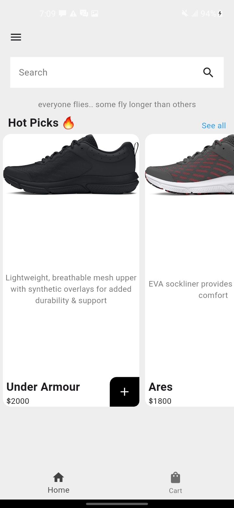
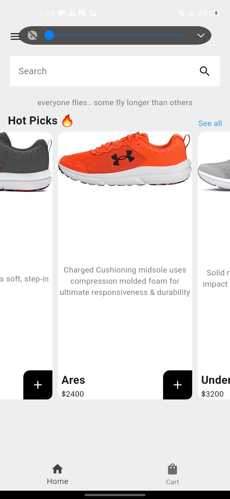
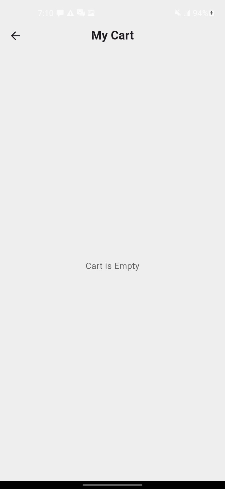

# A basic E-commerce app

## Flutter E-commerce app

A simple app where users can:
- Search for shopping items
- Add items to cart
- Delete items from cart
- View their cart
- Navigate through pages

## Getting Started 
1. Clone the repository
2. Run `flutter pub get` to install dependecies
3. Run `flutter run` to start the app

## Requirements
- Flutter SDK
- Android Studio or Vs code with relevant extensions

## Project Structure

- `lib/main.dart`: Project entry point
- `pubspec.yaml`: Project dependencies

## UI screenshots
- 
- 
- 
- 
- 
- 
- 
- 

